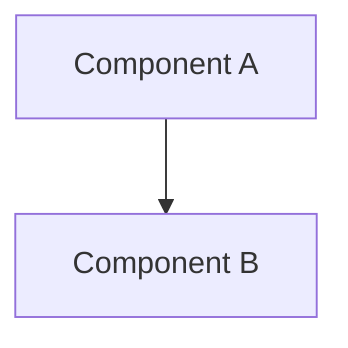

# Design: [Title]

Last reviewed: 2026-07-11
Date: YYYY-MM-DD
Author: [agent or human]
Status: draft | approved | superseded
Supersedes: [link or n/a]

---

## When to write a design doc

Write one when:
- A decision will be hard to reverse (schema, public API, data model, auth flow).
- Multiple reasonable approaches exist and the choice has non-obvious tradeoffs.
- The work touches multiple people, teams, or systems.
- You need async sign-off before starting.

Skip it when:
- The change is contained, obvious, and low-risk.
- A PR description or ADR is sufficient.
- You are prototyping and expect the design to change.

---

## Problem

What user or system problem does this solve? Why now?

## Requirements

### Must have

- [requirement]

### Nice to have

- [requirement]

### Non-requirements

- [explicit exclusion]

## Proposed design

Describe the chosen solution. Include diagrams (Mermaid preferred) where they add clarity.



### Key decisions

| Decision | Choice | Rationale |
|---|---|---|
| [decision point] | [chosen option] | [why] |

## Alternatives considered

### Option B: [name]

**Pros:** ...
**Cons:** ...
**Why not chosen:** ...

## Data model / schema changes

```
[schema or type definitions if applicable]
```

## API / interface changes

```
[signatures, endpoints, or contracts if applicable]
```

## Security & privacy considerations

- [consideration or "none identified"]

## Rollout & rollback

How will this be deployed? How do we roll back if it fails?

## Open questions

- [ ] [question]

## References

- [link]
